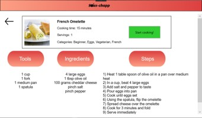
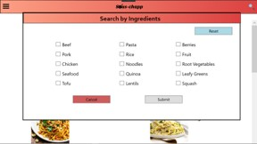
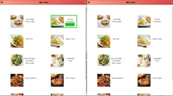
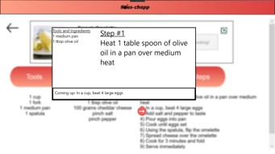

# Sous Chapp

This is a vertical protoype of an app that acts as a recipe database which can instruct a user step-by-step through recipes. It was created witihin a group using C# 
and utilizing methodology of user-centered system design, as part of a term project.

## Features
- Step-by-step recipe display: User can enter a new display that "steps" through the instructions of a recipe at their desired pace; recipes that are opened in the step display
can be closed or restarted

- Search by name and category: Search bar pops up upon selection of the search icon with an added virtual keyboard; option to browse recipes via categorical search pages with
multiple selectable categories that narrow results

- Split screen display: User can display multiple recipes at a time if desired and each will function independently on the same display

## Screenshots of High Fidelity Prototype

